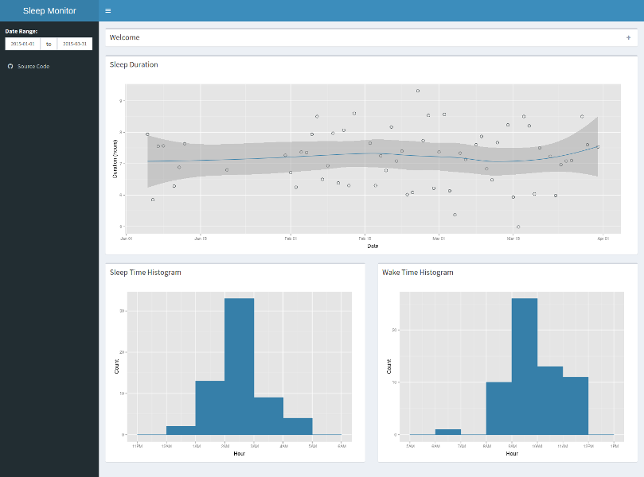

## Sleep Monitor

#### Developing Data Products Course Project

Created by [Yasser Gonzalez](http://yassergonzalez.com)

---

## What is Sleep Monitor?

<div style="height: 1em"></div>

#### Allows you to study your sleeping habits

<div style="height: 0.5em"></div>

#### Plots the sleep duration, sleep time, and wake time

---

## Screenshot



---

## A Glance at the Sample Data

```{r sleep_duration, echo=FALSE, fig.width=10, fig.height=6}
library("ggplot2")

source("../sleep_monitor/helpers.R", local = TRUE)

ggplot(sleep_data, aes(x = date, y = duration)) +
    geom_point(colour = "#1e282b", size = 3, shape = 1) +
    geom_smooth(method = "loess", colour = "#367fa9") +
    labs(x = "Date", y = "Duration (hours)") +
    theme(axis.title.x = element_text(vjust = -0.25),
          axis.title.y = element_text(vjust = 1))
```

<small>See the `.Rmd` file for the R code used to generate this plot</small>

---

## Try it Yourself!

<div style="height: 1em"></div>

### Shiny App
[https://yasserglez.shinyapps.io/sleep_monitor](https://yasserglez.shinyapps.io/sleep_monitor)

<div style="height: 0.5em"></div>

### Source Code
[https://github.com/yasserglez/devdataprod-project](https://github.com/yasserglez/devdataprod-project)
